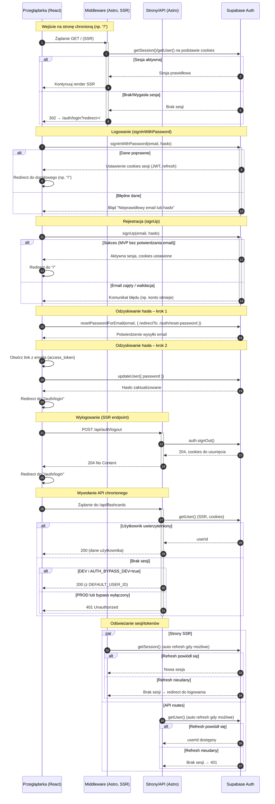

<authentication_analysis>
- Przepływy autentykacji (na podstawie PRD i specyfikacji):
  1) Rejestracja (signUp) z automatycznym zalogowaniem i przekierowaniem do "/".
  2) Logowanie (signInWithPassword) i przekierowanie do "/".
  3) Wylogowanie (POST /api/auth/logout) i przekierowanie do "/auth/login".
  4) Odzyskiwanie hasła – wysłanie emaila (resetPasswordForEmail) i ustawienie 
     nowego hasła (updateUser) po wejściu w link z mailem.
  5) Dostęp do stron chronionych – middleware SSR sprawdza sesję i 
     przekierowuje niezalogowanych na "/auth/login?redirect=...".
  6) Dostęp do API chronionego – endpointy weryfikują użytkownika przez 
     supabase.auth.getUser(); brak sesji → 401.
  7) Odświeżanie sesji/tokenów – klient SSR (@supabase/ssr) wykorzystuje 
     cookies do odświeżenia; przy niepowodzeniu → redirect/401.
  8) DEV bypass (opcjonalny) – w DEV z AUTH_BYPASS_DEV=true API używa 
     DEFAULT_USER_ID zamiast wymagać sesji.

- Aktorzy i interakcje: Przeglądarka (UI/React), Middleware (Astro, SSR), 
  Strony/Router (Astro), API (Astro API routes), Supabase Auth.

- Weryfikacja i odświeżanie tokenów: SSR klient Supabase na podstawie cookies 
  wywołuje getSession/getUser; przy wygaśnięciu próbuje odświeżyć; w razie 
  niepowodzenia – 401 lub redirect do logowania.

- Krótkie opisy kroków:
  - Rejestracja/Logowanie: UI wywołuje Supabase Auth; po sukcesie cookies 
    sesji są ustawione; UI wykonuje pełny redirect.
  - Middleware (chronione strony): sprawdza sesję; jeśli brak → redirect do 
    logowania z parametrem redirect.
  - API (chronione): sprawdza użytkownika; jeśli brak → 401; w DEV opcjonalny 
    fallback do DEFAULT_USER_ID.
  - Odzyskiwanie hasła: email z linkiem do /auth/reset-password; po wejściu 
    updateUser ustawia nowe hasło i redirect do logowania.
  - Wylogowanie: POST /api/auth/logout, Supabase signOut, czyszczenie cookies, 
    redirect do logowania.
</authentication_analysis>

<mermaid_diagram>

</mermaid_diagram>

