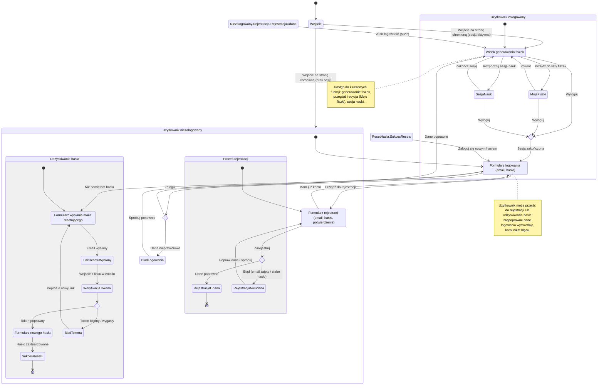

<user_journey_analysis>
- Ścieżki użytkownika (wg PRD i specyfikacji):
  - Rejestracja konta (US-001) z automatycznym zalogowaniem i przejściem do strony głównej.
  - Logowanie (US-002) z przekierowaniem do strony głównej po sukcesie.
  - Odzyskiwanie hasła: wysłanie maila resetującego → wejście z linku → ustawienie nowego hasła.
  - Dostęp do obszarów chronionych (US-009): niezalogowany → przekierowanie do logowania; zalogowany → dostęp do funkcji (generowanie fiszek, moje fiszki, sesja nauki).
  - Wylogowanie z głównego layoutu i powrót do logowania.

- Główne podróże i stany:
  - Niezalogowany: Strona logowania, Strona rejestracji, Odzyskiwanie hasła.
  - Zalogowany: Strona główna (generowanie), Moje fiszki, Sesja nauki, Wylogowanie.
  - Przejścia: próba wejścia w obszar chroniony, sukces/porażka logowania/rejestracji, poprawny/niepoprawny token resetu, wylogowanie.

- Punkty decyzyjne i alternatywne ścieżki:
  - Logowanie: poprawne vs błędne dane.
  - Rejestracja: udana (MVP bez potwierdzenia email) vs błąd (np. email zajęty, słabe hasło).
  - Reset hasła: token poprawny vs token błędny/wygasły.
  - Dostęp do chronionych zasobów: zalogowany vs niezalogowany (redirect do logowania z parametrem redirect).

- Cel stanów (krótkie opisy):
  - StronaLogowania: umożliwia uwierzytelnienie użytkownika.
  - StronaRejestracji: tworzy konto i (w MVP) loguje automatycznie.
  - OdzyskiwanieHasla: inicjuje i finalizuje reset hasła.
  - StronaGlowna/Zalogowany: dostęp do kluczowych funkcji aplikacji.
  - MojeFiszki/SesjaNauki: zarządzanie i nauka fiszek użytkownika.
  - Wylogowanie: kończy sesję i wraca do logowania.
</user_journey_analysis>

<mermaid_diagram>

</mermaid_diagram>

