<architecture_analysis>
- Komponenty i elementy (wg PRD i specyfikacji auth):
  - Layout: `src/layouts/Layout.astro` (nawigacja zależna od sesji, akcja Wyloguj)
  - Strony (Auth): `auth/login.astro`, `auth/register.astro`, `auth/forgot-password.astro`, `auth/reset-password.astro`
  - Strony (Aplikacja): `/` (`index.astro` z `GenerationPanel`), `/flashcards/index.astro`
  - Komponenty React (formularze): `LoginForm.tsx`, `RegisterForm.tsx`, `ForgotPasswordForm.tsx`, `ResetPasswordForm.tsx`
  - UI Shadcn: `button`, `card`, `input`, `label`, `checkbox`, `toast`, `avatar`, `skeleton`, `textarea`
  - Middleware/SSR: `src/middleware/index.ts` (SSR Supabase client, `locals.session`)
  - Supabase (przeglądarka): `src/db/supabase.client.ts` (logowanie/rejestracja/reset)
  - API (serwer): Auth Logout, Flashcards API, Generations API, Generations Accept API

- Główne strony i powiązane komponenty:
  - Login/Register/Forgot/Reset → odpowiednie formularze React + UI Shadcn
  - `/` i `/flashcards` → renderowane przy aktywnej sesji; korzystają z Layout i API

- Przepływ danych:
  - Formularze (React) → Supabase (client) → ustawienie cookies sesji → redirect do stron
  - Wejście na stronę chronioną → Middleware (SSR) sprawdza `locals.session` → przepuszcza lub kieruje do logowania
  - Strony/Komponenty → API (serwer) → Supabase (SSR) → odpowiedzi do UI

- Funkcjonalność komponentów (skrót):
  - `LoginForm`/`RegisterForm` → walidacja, wywołania `signInWithPassword`/`signUp`, toasty, redirect
  - `ForgotPasswordForm`/`ResetPasswordForm` → reset hasła (email + ustawienie nowego)
  - `Layout.astro` → nawigacja zależna od sesji, akcja `Wyloguj`
  - Middleware → SSR klient Supabase, `locals.supabase`, `locals.session`, bramkowanie ścieżek
  - API → operacje domenowe (flashcards/generations), egzekwowanie auth (401 gdy brak sesji; opcjonalny DEV bypass)

```mermaid
flowchart TD

  %% Subgrafy główne
  subgraph Layouts
    LayoutAstro[Layout.astro]
  end

  subgraph "Strony (Auth)"
    AuthLoginPage[auth/login.astro]
    AuthRegisterPage[auth/register.astro]
    AuthForgotPage[auth/forgot-password.astro]
    AuthResetPage[auth/reset-password.astro]
  end

  subgraph "Strony (Aplikacja)"
    HomePage["index.astro (Generowanie)"]
    FlashcardsPage[flashcards/index.astro]
  end

  subgraph "Komponenty React (Formularze)"
    LoginForm[LoginForm.tsx]
    RegisterForm[RegisterForm.tsx]
    ForgotForm[ForgotPasswordForm.tsx]
    ResetForm[ResetPasswordForm.tsx]
  end

  subgraph "UI współdzielone (Shadcn/ui)"
    UI_Button[button]
    UI_Card[card]
    UI_Input[input]
    UI_Label[label]
    UI_Checkbox[checkbox]
    UI_Toast[toast]
    UI_Avatar[avatar]
    UI_Textarea[textarea]
    UI_Skeleton[skeleton]
  end

  subgraph "Middleware / SSR"
    MiddlewareAstro["Astro Middleware"]
    SSRClient["SSR Supabase Client"]
    SessionLocals["Session (locals)"]
  end

  subgraph "API (Serwer)"
    ApiAuthLogout["API: Wylogowanie"]
    ApiFlashcards["API: Fiszki"]
    ApiGenerations["API: Generowanie"]
    ApiGenAccept["API: Akceptacja propozycji"]
  end

  subgraph "Supabase"
    SupabaseBrowser["Supabase (przeglądarka)"]
    SupabaseAuth["Supabase Auth"]
  end

  %% Relacje layoutu i stron
  LayoutAstro --- HomePage
  LayoutAstro --- FlashcardsPage
  LayoutAstro --- AuthLoginPage
  LayoutAstro --- AuthRegisterPage
  LayoutAstro --- AuthForgotPage
  LayoutAstro --- AuthResetPage

  %% Render formularzy w stronach auth
  AuthLoginPage --> LoginForm
  AuthRegisterPage --> RegisterForm
  AuthForgotPage --> ForgotForm
  AuthResetPage --> ResetForm

  %% Formularze korzystają z UI Shadcn
  LoginForm -.-> UI_Button
  LoginForm -.-> UI_Input
  LoginForm -.-> UI_Label
  LoginForm -.-> UI_Toast
  RegisterForm -.-> UI_Button
  RegisterForm -.-> UI_Input
  RegisterForm -.-> UI_Label
  RegisterForm -.-> UI_Toast
  ForgotForm -.-> UI_Button
  ForgotForm -.-> UI_Input
  ForgotForm -.-> UI_Label
  ForgotForm -.-> UI_Toast
  ResetForm -.-> UI_Button
  ResetForm -.-> UI_Input
  ResetForm -.-> UI_Label
  ResetForm -.-> UI_Toast

  %% Przepływy autentykacji (CSR)
  LoginForm --> SupabaseBrowser
  RegisterForm --> SupabaseBrowser
  ForgotForm --> SupabaseBrowser
  ResetForm --> SupabaseBrowser
  SupabaseBrowser --> SupabaseAuth
  SupabaseAuth --> SupabaseBrowser
  SupabaseBrowser -->|Ustawienie cookies sesji| MiddlewareAstro

  %% Wejścia na strony chronione
  HomePage --> MiddlewareAstro
  FlashcardsPage --> MiddlewareAstro
  MiddlewareAstro --> SSRClient
  SSRClient --> SessionLocals
  SessionLocals -->|Sesja OK| HomePage
  SessionLocals -->|Sesja OK| FlashcardsPage
  MiddlewareAstro -->|Brak sesji → redirect| AuthLoginPage

  %% Strony/komponenty korzystają z API (serwer)
  HomePage --> ApiGenerations
  HomePage --> ApiGenAccept
  FlashcardsPage --> ApiFlashcards
  LayoutAstro -->|Akcja Wyloguj| ApiAuthLogout

  %% API weryfikuje użytkownika (SSR Supabase)
  ApiFlashcards --> SSRClient
  ApiGenerations --> SSRClient
  ApiGenAccept --> SSRClient
  ApiAuthLogout --> SSRClient

  %% SSR klient rozmawia z Supabase Auth (cookies)
  SSRClient --> SupabaseAuth

  %% Opcjonalny DEV bypass (tylko lokalnie)
  DevBypass[(Tryb DEV: AUTH_BYPASS_DEV)]
  DevBypass -.-> ApiFlashcards
  DevBypass -.-> ApiGenerations
  DevBypass -.-> ApiGenAccept

  %% Wyróżnienie elementów modyfikowanych przez wdrożenie auth
  classDef updated fill:#fff4e5,stroke:#e67e22,stroke-width:2px;
  class LayoutAstro,MiddlewareAstro,SSRClient,SessionLocals,ApiGenerations updated;
```

</architecture_analysis>

<mermaid_diagram>

</mermaid_diagram>

